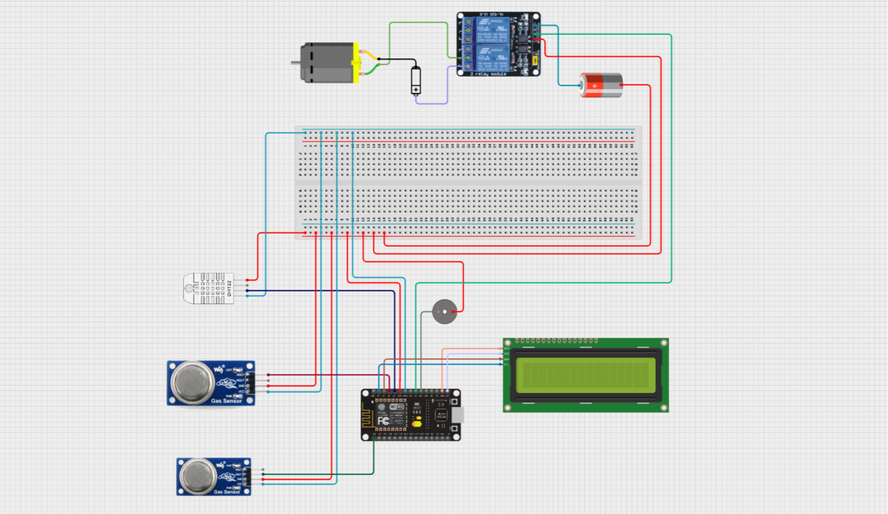
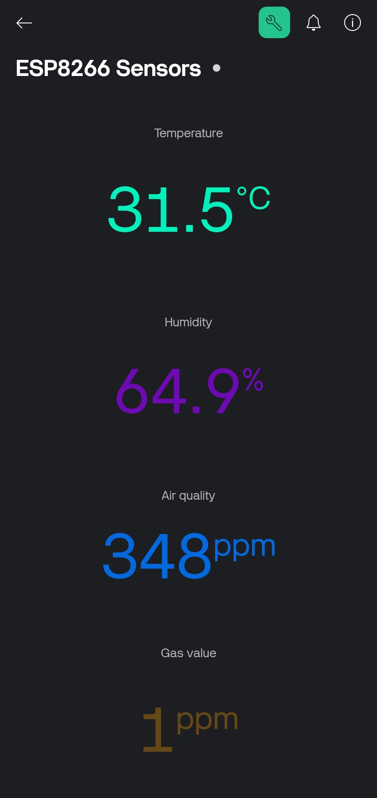
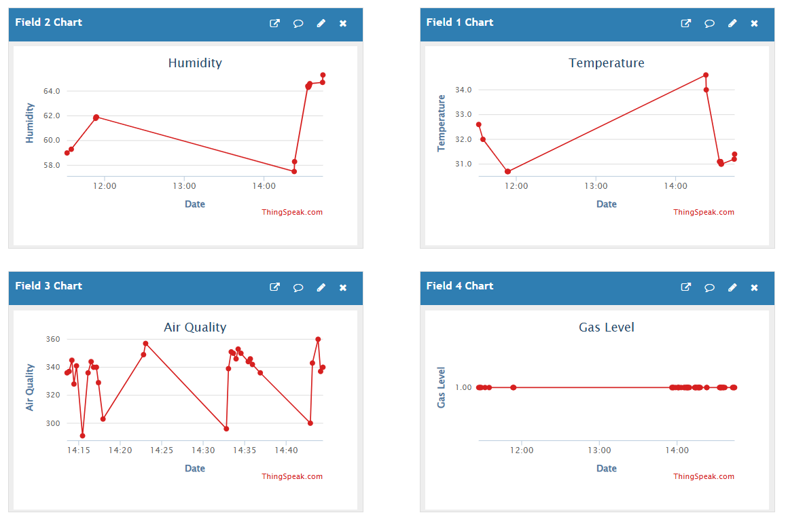

# Smart Kitchen Air Quality and Safety Monitoring System

## Abstract
The Smart Kitchen Air Quality and Safety Monitoring System is an IoT-based solution designed to monitor environmental conditions in kitchens, ensuring safety and comfort. It uses NodeMCU ESP8266 to collect real-time data from DHT22 (temperature & humidity), MQ-135 (air pollution), and MQ-2 (smoke) sensors. Sensor readings are displayed on a 16x2 I2C LCD, while a buzzer provides audio alerts for unsafe conditions. The system also controls a ventilation fan via a relay, activating it automatically when smoke is detected. Data is sent to Blynk and ThingSpeak platforms for cloud-based monitoring, enabling users to track kitchen air quality remotely.

**Keywords:** NodeMCU ESP8266, DHT22, MQ-135, MQ-2, IoT, Blynk, ThingSpeak, Air Quality Monitoring, Automatic Ventilation, Real-Time Alerts

---

## Hardware Components
All hardware components used for the project are listed in [components-list.md](hardware/components-list.md).

---

## Schematics & Diagrams
### Circuit Diagram

---

## Libraries
Required libraries and installation instructions are listed in [`libraries.md`](arduino-code/libraries.md).

---

## Software Overview
The NodeMCU ESP8266 firmware (`arduino-code/smart_kitchen.ino`) handles:

- Reading sensor data from DHT22, MQ-135, and MQ-2.
- Activating the buzzer and relay-controlled fan based on predefined thresholds.
- Updating the 16x2 LCD with live sensor readings and alerts.

---

## Usage Instructions
1. Assemble the hardware according to the circuit diagram. Ensure all connections are secure.  
2. Connect NodeMCU to your computer via USB.  
3. Open Arduino IDE, load `arduino-code/smart_kitchen.ino`, and upload it to NodeMCU.  
4. Make sure all required libraries are installed via Arduino Library Manager.  
5. Update WiFi credentials in the code for proper cloud connectivity.  
6. Power the relay module and DC motor fan using an external 5V supply, with GND connected to NodeMCU GND.  
7. Open the Serial Monitor to verify sensor readings and cloud updates.  
8. Monitor real-time data on Blynk and ThingSpeak dashboards.  
9. When smoke is detected, the relay will turn on the fan, and the buzzer will sound as an alert.  
10. Ensure stable WiFi connectivity for continuous data upload and remote monitoring.

---

## Cloud Platform Screenshots

<table>
<tr>

<td width="25%" valign="top" style="padding-right: 20px;">

<h3 align = "center"> Blynk Dashboard </h3>

</td>

<td width="75%" valign="top" style="padding-left: 40px;">

<h3 align = "center"> Thingspeak Dashboard </h3>

</td>

</tr>
</table>

---

## Demo Video

